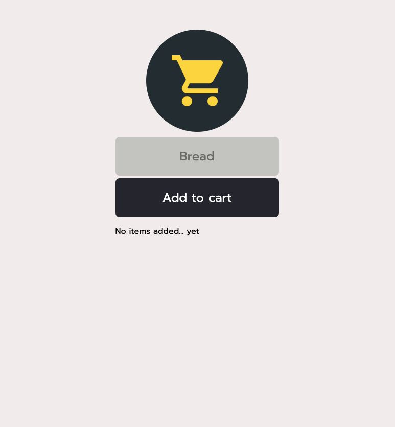

# firebase-mobile-app

A mobile shopping list app built using Firebase and deployed with Netlify

## Description

This is a mobile-first application designed to allow users to be able to easily create and update a shopping list for their trips to the grocery store. The front-end has been deployed using netlify, and the back-end uses Firebase as a real-time database to store users' added items. It allows functionality of adding and deleting items simply by pressing the item in the list.

## Table of Contents

- [Built Using](#built-using)
- [Deployed Application](#deployed-application)
- [Usage](#usage)
- [Screenshot](#screenshot)
- [Credits](#credits)
- [Updates](#updates)
- [Socials](#socials)

## Built Using

    

## Deployed Application

The application can be viewed via Heroku at: https://my-add-to-cart.netlify.app/

## Usage

- Items can be added to the list by entering an item and pressing "add to cart"
- To delete an item from your list, simply click or press the item to remove

## Screenshot

## Updates

Further version updates to the app would include:

1. Optimizing the user experience for mobile applications including removing color highlight on add to card when clicking on phones
2. Adding a user authentication feature including sign-up and login to better ensure privacy 3
3. Separate lists or categories for different types of shopping
4. "Wish List" section of desired items
5. Stylistic / font / logo improvements

## Questions

GitHub: [samocain93](https://github.com/samocain93)

## Socials

